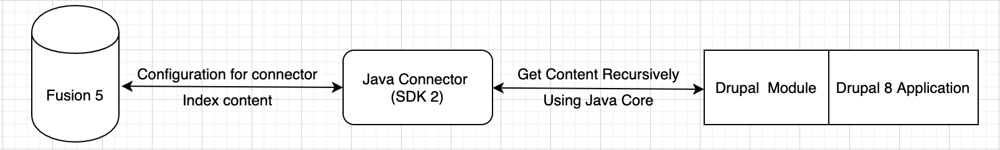

# Drupal8 Connector

## Connector Description

The Drupal Connector fetches all the content that is available on the URL provided from Drupal Module. Using an algorithm that takes all the links from every page, all the content from those pages is going to be parsed and normalised in a Fusion 5 Server instance, using the SDK connector. 

## Support

This is a community supported Fusion connector.

## System Diagram
The System Diagram presents the 3 components and how are connected. Fusion is the component where the Java Connector will be uploaded as a plugin. This connector plugin will then be used as a datasource in _Index Workbench_. One of the properties that this connector expects is a URL coming from Drupal Module, from where all the content will be taken recursively and get indexed.

 

## Quick start

### Clone the repo:
```
git clone https://github.com/lucidworks/drupal-connector.git
```

### Build the project:
```
cd drupal8
./gradlew clean build assemblePlugin
```
 This produces the zip file, named `drupal8.zip`, located in the `build` directory.
This artifact is now ready to be uploaded directly into Fusion Server as a connector plugin.

### Connector properties
This connector is using the `connector-plugin-sdk` version `2.0.1` which is compatible with Fusion Server 5.

#### Properties required
1. **_Drupal URL_** - the link from where this connector takes all the content.
2. **_Username_** - the username used to login into drupal to be able to fetch a specific type of content. There are different roles for users defined in that module.
3. **_Password_** 
4. **_Login Path_** - the path used to the login request - ```defaultValue = "/user/login"``` 
4. **_Logout Path_** - the path used to the logout request - ```defaultValue = "/user/logout"```
5. **_Entry Path_** -  this entry indicates the page from where fetching the content begins - ```defaultValue = "/en/fusion"```

#### Properties added in MANIFEST.MF
```
Plugin-Id: com.lucidworks.fusion.connector
Plugin-Type: connector
Plugin-Provider: Lucidworks
Plugin-Version: 1.0-SNAPSHOT
Plugin-Connectors-SDK-Version: 2.0.1
Plugin-Class: com.lucidworks.fusion.connector.ConnectorPlugin
```

### The Fetcher
The **_JsonContentFetcher_** class provides methods that define how data is fetched and indexed for Fusion Server. The data is fetched from Drupal using HttpUrlConnection to call the request. But before the actual request is done to get all the content a login request is needed. There are different types of users that can see the entire content or just a particular part from it.
 From the login response the header _Set-Cookie_ is taken and used as a header for the next requests.
 
### Crawling process
The **_DrupalContentCrawler_** is the class where the data for indexing is resolved. The startCrawling function will do a GET request to all URLs saved in **drupalUrls** and prepare the next step of execution. All the content is saved in a map **topLevelJsonapiMap**. This process is running until **drupalUrls** has values. 
If you need to check if the process is done you can check the value of **processFinished** flag.

#### JSON:API
The content from Drupal URL has a JSON:API format.

JSON:API is a specification for how a client should request the resources to be fetched or modified, and how a server should respond to those requests.
JSON:API is designed to minimize both the number of requests and the amount of data transmitted between clients and servers. This efficiency is achieved without compromising readability, flexibility, or discoverability.

JSON:API requires use of the JSON:API media type `application/vnd.api+json` for exchanging data.

## Dependencies
The most important dependency is the SDK connector. The SDK connector used in this project can be found [here](https://github.com/lucidworks/connectors-sdk-resources/tree/master/java-sdk).

### Java Core HttpUrlConnection
The HttpUrlConnection class allows us to perform basic HTTP requests without the use of any additional libraries. All the classes that are needed are contained in the **java.net** package.

### Lombok 
Lombok is a java library that automatically plugs into your editor and build tools and replaces using annotations most of the code regarding getters, setters and even constructors.

